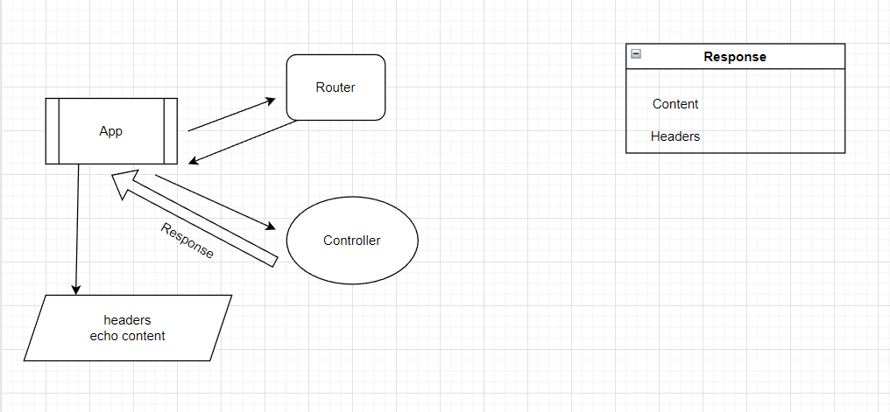

### Разделение на роуты
- ✔ Выяснить как работает вывод View

- 
  - Подумать где (в каких классах) работать с авторизацией.
  - Возвращать всегда 1 объект
    ```php
    Response() {headers, body};
    header(response->headers);
    echo response->body;
    ```

ДЗ
- Еще раз проверить, что регистрация и авторизация не завязаны на поддомене. [admin => admin, driver => driver]
- Одна точка входа, одна точка выхода.
- **Посмотреть как работают шаблонизаторы (blade, smarty)**. Попробовать написать свой или использовать готовый.
- Посмотреть как парсить файл .env
- Вводим адрес в инпут: Откуда и куда. 2 точки отмечаются на на карте и прокладывается маршрут

